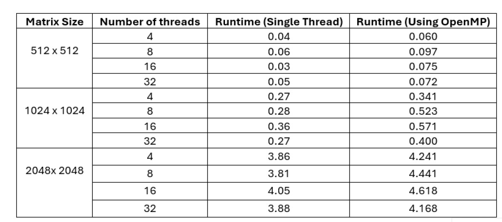

The OpenMP parallelization technique is used in the pseudocode that follows to implement the Gaussian elimination procedure. Gaussian elimination is applied to a matrix object U using the gauss_eliminate_using_omp function. The matrix U represents a set of augmented linear equations. The number numbers_of_element denote the number of rows (or columns) in matrix U. Under the direction of the variable k, the outer loop iterates over the diagonal elements of the matrix U from the first row (k=0) to the last row (k= numbers_of_element –1). This loop performs the elimination stages of the Gaussian elimination technique.

The first parallel zone is designated by the OpenMP directive #pragma omp parallel for private(j) shared (U, k). It parallelizes the loop that modifies the matrix U's columns for a given row, k. Every thread in the parallel zone is assigned a unique column (j) to work on. Afterwards, this code can distribute the work across multiple threads using OpenMP parallelization, allowing the division and elimination stages of the Gaussian elimination technique to be completed simultaneously.

```
void gauss_eliminate_using_omp(Matrix U)
{
    int numbers_of_element = U.num_rows;
    int k, i, j;

    for (k = 0; k < numbers_of_element; k++) {
        #pragma omp parallel for private(j) shared(U, k)
        for (j = (k + 1); j < numbers_of_element; j++) {
            if (U.elements[numbers_of_element * k + k] == 0) {
                fprintf(stderr, "Numerical instability. The principal diagonal element is zero.\n");
                exit(EXIT_FAILURE);
            }
            U.elements[numbers_of_element * k + j] = (float)(U.elements[numbers_of_element * k + j] / U.elements[numbers_of_element * k + k]); /* Step of division */
        }

        U.elements[numbers_of_element * k + k] = 1; /* In U, set the primary diagonal entry to 1 */

        #pragma omp parallel for private(i, j) shared(U, k)
        for (i = (k + 1); i < numbers_of_element; i++) {
            for (j = (k + 1); j < numbers_of_element; j++)
                U.elements[numbers_of_element * i + j] = U.elements[numbers_of_element * i + j] - (U.elements[numbers_of_element * i + k] * U.elements[numbers_of_element * k + j]); /* Step of elimination */

            U.elements[numbers_of_element * i + k] = 0;
        }
    }
}
```

The performance outcome is as follows: 


 


In Summary Only larger matrices show performance gains from parallel implementation. The overhead associated with thread creation causes the speed advantages to revert after a certain number of threads.
